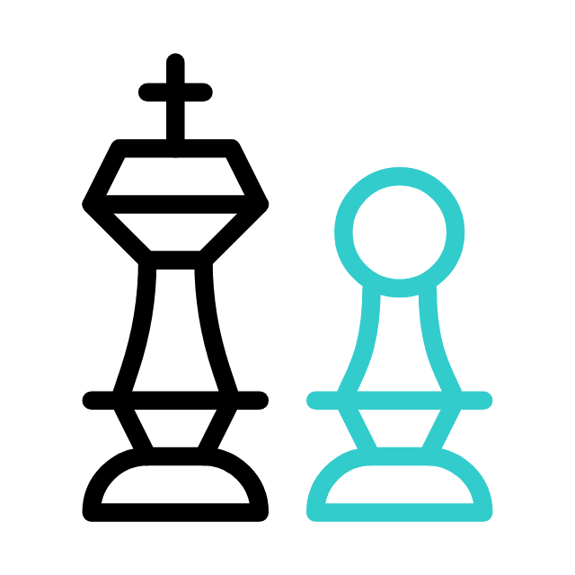
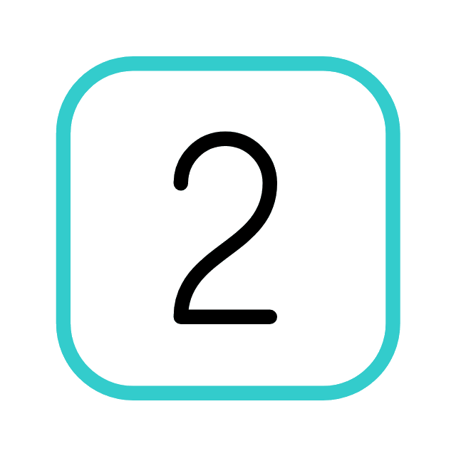
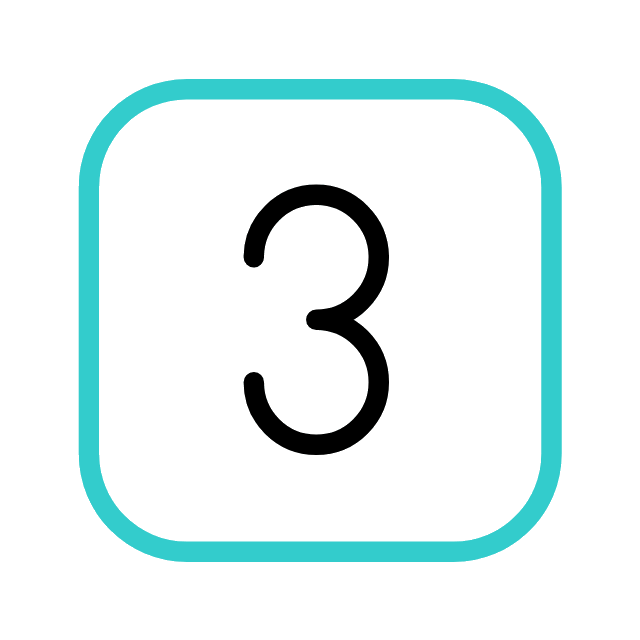
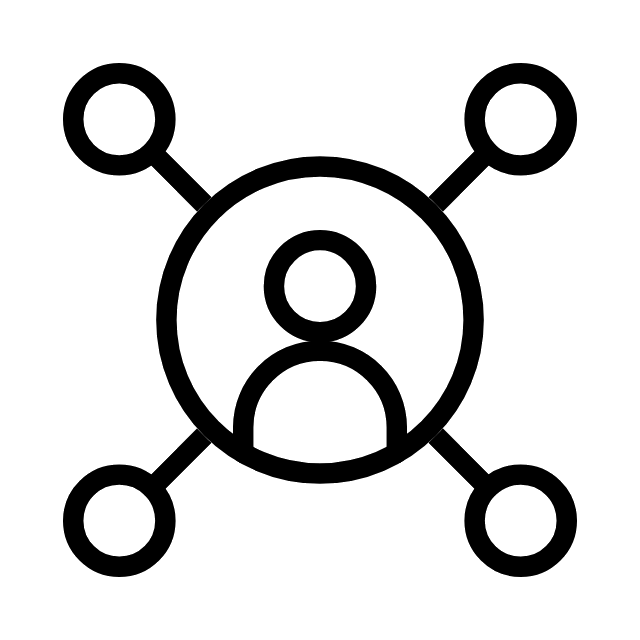

<h1 align="center">Hello World, I'm Shourouk Nour El Dine </h1>
<h3 align="center">   Seeking & Spilling Knowledge  </h3>

###  About myself:

 B.Sc. in Bioinformatics from the <a href="https://www.lau.edu.lb/">Lebanese American University (LAU) </a>  
 <a href="https://instagram.com/fred_draws">Pencil artist </a> & chess player  
 Software Engineer at <a href="https://www.bcomsat.com/">BCom Offshore </a>  
 Algorithms & Data Structures Instructor at <a href="https://sefactory.io/">SE Factory </a>  
 Researching to improve Anti-Microbial Resistance prediction using deep CNNs at LAU  
 Delving deeper into Convolutional Neural Networks & Full Stack Web Development  
 Sipping tea & blasting music while firing my neurons

###  My interests:

 Full-Stack Web Development  
 Machine Leaning   
 Data analysis  
 Software engineer  
 *and more...* 

###  Reach out & connect with me to share & discuss inovative ideas:

**shourouknoureldine@gmail.com** 
###  Languages:

 
  
  
 
  
  
 
<code></code>
<code></code>
<code></code>
<code></code>
<code></code>
<code></code>

###  Tools:  

<code></code>
<code></code>
<code></code>
<code></code>
<code></code>
<code></code>
<code></code>

###  Some statistics:

    

        
    

    

        
    

